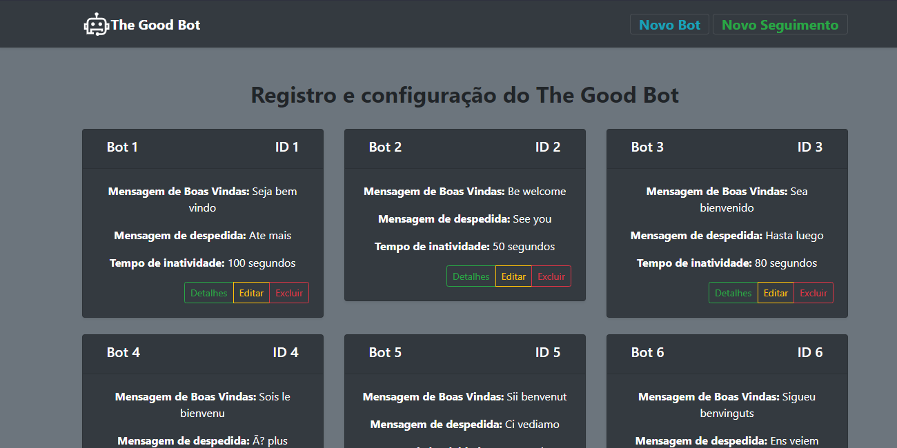
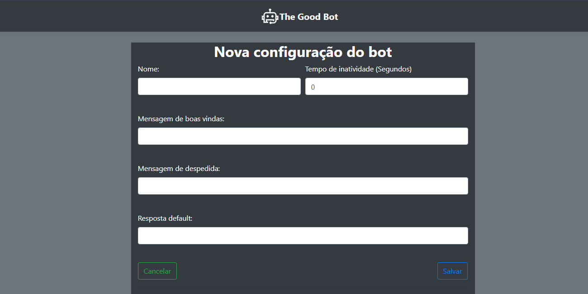
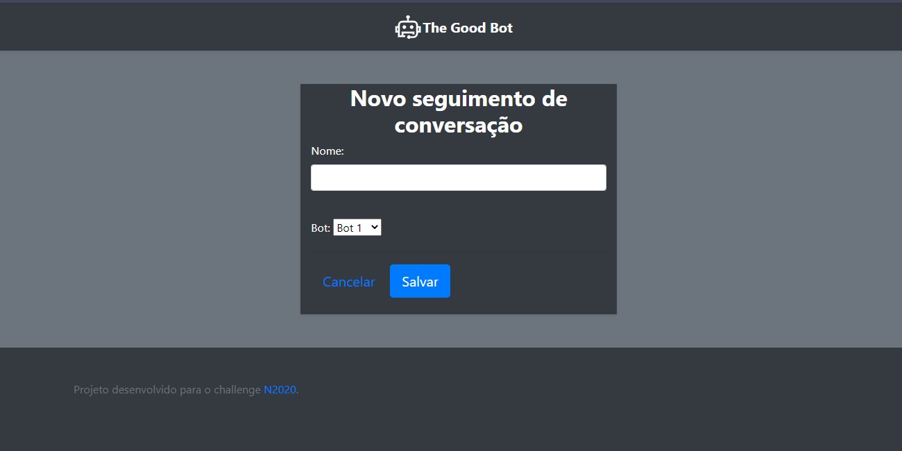
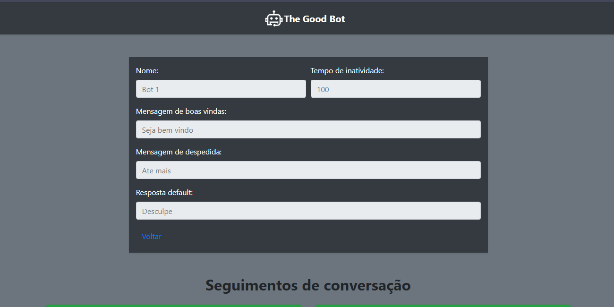
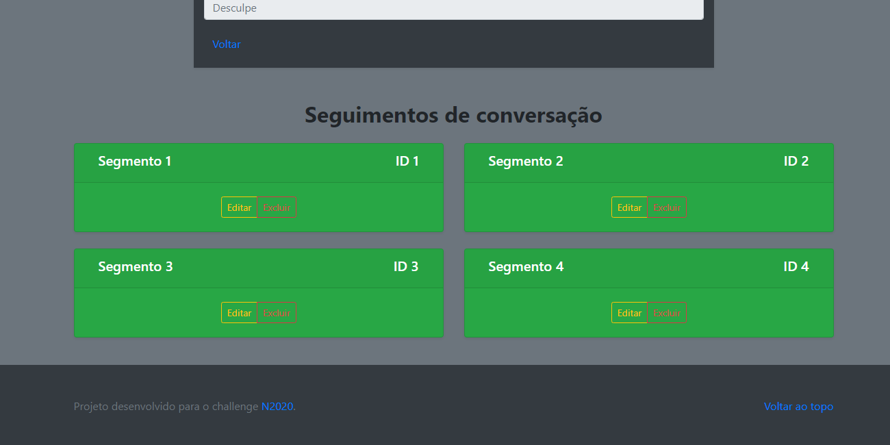
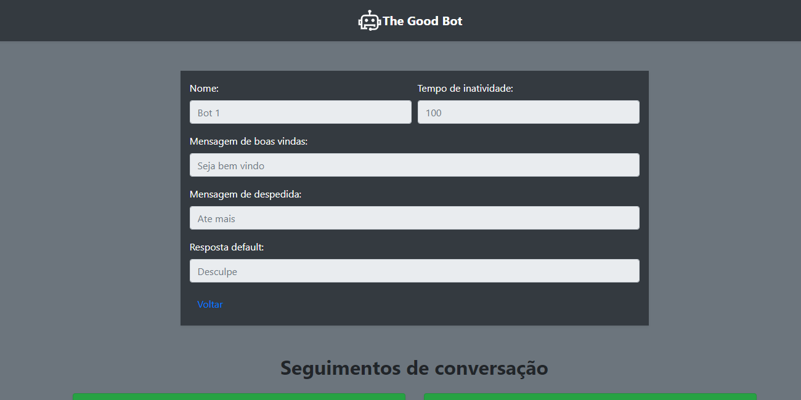

# The God Bot

<h1 align="center">
    
</h1

Aplicação web para registro e configuração da inteligência do TheGoodBot. CRUD completo desenvolvido em Spring Boot para a disciplina de Microservice And Web Engineering e o challenge <a href="https://www.fiap.com.br/graduacao/n2020">N2020</a>

<div style="text-align: center">
    <table>
        <tr>
            <td style="text-align: center">
                
      </br>
            </td>            
            <td style="text-align: center">
                
      </br>
            </td>
            <td style="text-align: center">
                
      </br>
            </td>
        </tr>
        <tr>
            <td style="text-align: center">
                
      </br>
            </td>
            <td style="text-align: center">
                
  </br>
            </td>
            <td style="text-align: center">
                
  </br>
            </td>
        </tr>
    </table>
</div>
  
Esse projeto foi desenvolvido com as seguintes tecnologias:

- [Spring Boot](https://spring.io)
- [Gradle](https://gradle.org)
- [Hibernate](https://hibernate.org)
- [Oracle Database](https://www.oracle.com/br/database/)
- [Bootstrap](https://getbootstrap.com)

## Get Started

Clone o repositório em sua máquina

```git clone https://github.com/RaykRocha/the-good-bot```

Altere o arquivo application.properties adicionando a url do seu banco, user e senha

```
spring.datasource.url=URL
spring.datasource.username=USERNAME
spring.datasource.password=PASSWORD
```

Na primeira vez altere a propriedade “spring.jpa.hibernate.ddl-auto” para create (isso vai popular o banco).

Cuidado com essa propriedade, de padrão ela vem como validate.
```
spring.jpa.hibernate.ddl-auto=validate
```

Execute o projeto e acesse

```
http://localhost:8080/fiap/bot
```
## Integrantes

> [**Jefrey Marcus Machado**](https://www.linkedin.com/in/jefreymarcus/) - *RM81694*<br>
> [**Jonatas Martins De Castro**](https://www.linkedin.com/in/jonatas-martins-de-castro-bb9397106/) - *RM81510* <br>
> Lucas Lima Teixeira - *RM81541*<br>
> [**Marcos Farias**](https://www.linkedin.com/in/fmarcoos/) - *RM81723*<br>
> [**Rayk Rocha**](https://www.linkedin.com/in/rayk/) - *RM81723*


