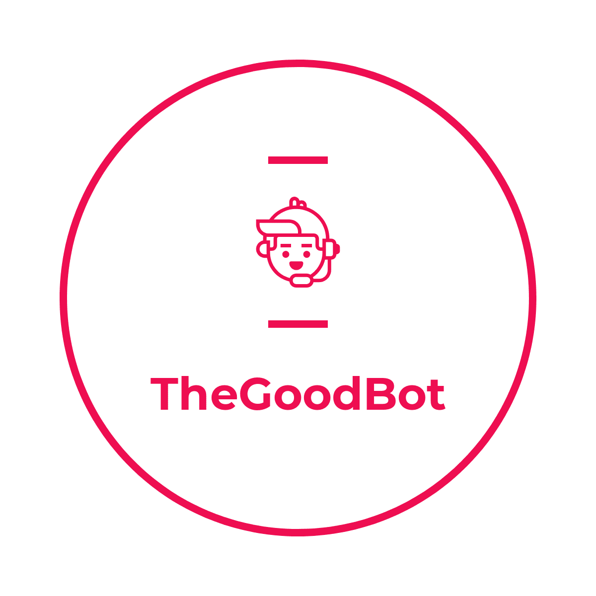

# The God Bot

<h1 align="center">
    
</h1

Aplicação web para registro e configuração da inteligência do TheGoodBot. CRUD completo desenvolvido em Spring Boot para a disciplina de Microservice And Web Engineering e o challenge <a href"https://www.fiap.com.br/graduacao/n2020">N2020</a>.

    <table>
        <tr>
            <td style="text-align: center">
                
       
            </td>            
            <td style="text-align: center">
                
       
            </td>
            <td style="text-align: center">
                
       
            </td>
        </tr>
        <tr>
            <td style="text-align: center">
                
       
            </td>
            <td style="text-align: center">
                
   
            </td>
            <td style="text-align: center">
                
   
            </td>
        </tr>
    </table>

  
Esse projeto foi desenvolvido com as seguintes tecnologias:

- [Spring Boot](https://spring.io)
- [Gradle](https://gradle.org)
- [Hibernate](https://hibernate.org)
- [Bootstrap](https://getbootstrap.com)

